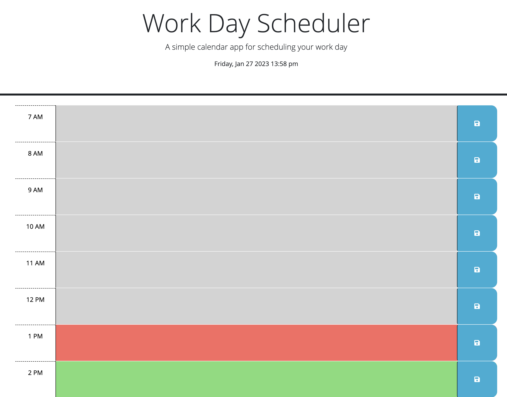
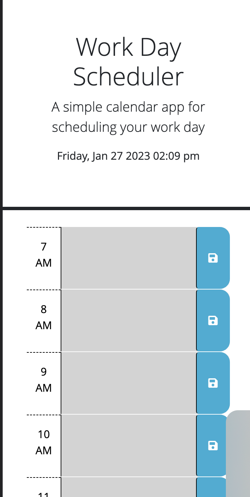

# API_Daily_Agenda - Challenge 5
Welcome to the API Daily Agenda for the Module 5 Challenge!
January 26th, 2023

# Deployment Link

https://melissataylor1.github.io/API_Daily_Agenda/

# Description
### Why was this project significant?
This weeks module introduced the FullStack Flex class to Third-Party APIs,  building on our previous JavaScript and Web API modules. For this project, we were specifically requested to use the API Day.js and Jquery to complete the task. JQuery is a Web API that functions as a JavaScript library. Day.js is a third party API that "parses, validates, manipulates, and displays dates and times for modern browsers with a largely Moment.js-compatible API." APIs, especially those offered by Third Parties, are a lucrative tool to any web developer when writing code. They can save time, save space, clarify code - There are lots of functions only made possible through APIs.

### What did this project ask of us? 
The Module 5 Challenge was create a simple calendar application that allows a user to save events for each hour of the day by modifying starter code. The planner will be set up with timeblocks for standard business hours, with the current hour/past hours/future hours all displayed in different colors, to enhance the UX. It is supposed to display the current day and date at the top of the calender, as well as save events within time blocks using local storage. 

# Screenshot
Here are various screenshots of my finished site page.

### Desktop View

### Mobile View

# Liscenses/Credits

The MIT License (MIT)

CSS and HTML were provided to us before hand, I did not create them, only slightly modified 

Day.js and Jquery 
